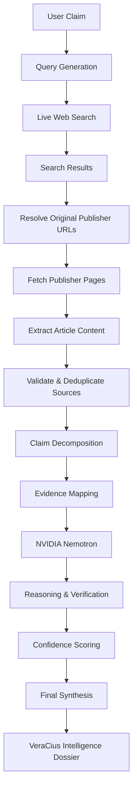
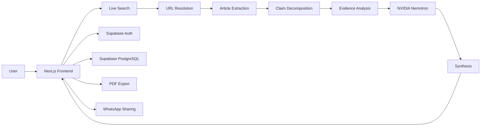

# 🔴 VeraCius AI

## **VERIFY WHAT MATTERS.**

**AI-powered information verification through live web research,
evidence extraction, multi-source corroboration, and reasoning.**

[](#)
[](#)
[](#)
[](#)
[](#)

> **From Claim → Evidence → Verification**

------------------------------------------------------------------------

## ⚡ What is VeraCius?

**VeraCius AI** is an AI-powered information verification platform
designed to investigate claims using **real-time web evidence instead of
relying solely on an LLM's internal knowledge.**

Instead of asking an AI:

> *"Is this true?"*

VeraCius asks:

> **"What evidence exists, where did it come from, how independently is
> it corroborated, and what conclusion does that evidence support?"**

The system combines:

-   🌐 Live web search
-   📰 Real publisher discovery
-   🔗 Original-source URL resolution
-   📄 Article extraction
-   🧩 Claim decomposition
-   🔍 Evidence analysis
-   🕸️ Multi-source corroboration
-   🧠 NVIDIA Nemotron reasoning
-   📊 Confidence scoring
-   🗂️ Analysis history
-   📑 PDF reports
-   💬 WhatsApp sharing

### **Don't just generate an answer. Investigate the evidence.**

------------------------------------------------------------------------

## 🎥 See VeraCius in Action

Add an actual recording/GIF at `docs/demo.gif`.


### Verification workflow

``` text
CLAIM
  ↓
LIVE WEB SEARCH
  ↓
REAL PUBLISHERS
  ↓
ORIGINAL URL RESOLUTION
  ↓
ARTICLE EXTRACTION
  ↓
CLAIM DECOMPOSITION
  ↓
EVIDENCE ANALYSIS
  ↓
NVIDIA NEMOTRON
  ↓
VERDICT + CONFIDENCE
```

------------------------------------------------------------------------

# 🧬 Core Capabilities

  -----------------------------------------------------------------------
  Capability                          Description
  ----------------------------------- -----------------------------------
  🌐 **Live Web Intelligence**        Performs live web research instead
                                      of relying exclusively on static
                                      model knowledge.

  📰 **Real Publisher Sources**       Discovers real publishers and
                                      resolves intermediary URLs toward
                                      original articles whenever
                                      possible.

  🧩 **Claim Decomposition**          Breaks complex articles into
                                      meaningful individual claims for
                                      independent evaluation.

  🕸️ **Evidence Network**             Visualizes relationships between
                                      claims and supporting sources
                                      through an interactive evidence
                                      graph.

  🧠 **AI Reasoning**                 Uses NVIDIA Nemotron for
                                      evidence-based reasoning and
                                      synthesis.

  📊 **Confidence Scoring**           Produces verification states and
                                      confidence scores based on
                                      available evidence.

  📑 **PDF Reports**                  Exports completed investigations
                                      into structured reports.

  👤 **Accounts & History**           Uses Supabase authentication and
                                      account-linked analysis history.

  💬 **WhatsApp Sharing**             Allows concise analysis summaries
                                      to be shared through WhatsApp.
  -----------------------------------------------------------------------

------------------------------------------------------------------------

# 🔬 Verification Pipeline



------------------------------------------------------------------------

# 🧠 Why Evidence-First?

Traditional LLM-based fact checking can suffer from:

-   stale knowledge
-   hallucinated sources
-   fabricated citations
-   insufficient corroboration
-   confusing repeated reporting with independent evidence

VeraCius addresses these problems by separating:

``` text
SEARCH
   ↓
RETRIEVE
   ↓
EXTRACT
   ↓
VERIFY
   ↓
REASON
   ↓
SYNTHESIZE
```

The model is therefore not treated as the source of truth.

**The evidence is.**

------------------------------------------------------------------------

# 🕸️ Evidence Network

Every verification can produce a visual evidence network.

``` text
                    ┌───────────────┐
                    │  CLAIM ORIGIN │
                    └───────┬───────┘
                            │
             ┌──────────────┼──────────────┐
             │              │              │
             ▼              ▼              ▼
        ┌─────────┐    ┌─────────┐    ┌─────────┐
        │ Source A│    │ Source B│    │ Source C│
        └─────────┘    └─────────┘    └─────────┘
```

Sources can expose:

-   Publisher
-   Domain
-   Confidence
-   Source summary
-   Original article
-   Evidence relationship

Where an original publisher URL is resolved, clicking the source takes
the user directly to that article.

------------------------------------------------------------------------

# 🧩 Claim Decomposition

Rather than treating an article as one giant statement, VeraCius breaks
it into meaningful claims.

``` text
ARTICLE
 │
 ├── CLAIM 01
 │   └── Police promised action within 72 hours
 │
 ├── CLAIM 02
 │   └── Protesters gathered outside Parliament Street police station
 │
 ├── CLAIM 03
 │   └── A particular allegation was made
 │
 └── ...
```

Each claim can receive:

``` text
VERIFIED
UNVERIFIED
CONFIDENCE
EVIDENCE
SOURCE CORROBORATION
```

------------------------------------------------------------------------

# 🧠 AI Reasoning Architecture

The AI layer is powered by:

`nvidia/nemotron-3-ultra-550b-a55b`

through NVIDIA NIM's OpenAI-compatible API.

``` text
Nemotron Response
       │
       ├───────────────┐
       ▼               ▼
reasoning_content   content
       │               │
       │               ▼
       │         JSON Extraction
       │               │
       │               ▼
       │         Schema Validation
       │               │
       │               ▼
       │        Final User Result
       │
       └── never exposed as final UI content
```

Raw model output is not treated as trusted structured data. Responses
are parsed and validated before being consumed by the frontend.

------------------------------------------------------------------------

# 🏗️ System Architecture



------------------------------------------------------------------------

# 🛠️ Technology Stack

  Layer            Technology
  ---------------- ------------------------------
  Frontend         Next.js + React
  Language         TypeScript
  Styling          Tailwind CSS
  Authentication   Supabase Auth
  Database         PostgreSQL / Supabase
  ORM              Prisma
  AI               NVIDIA NIM
  AI Model         Nemotron 3 Ultra
  Web Research     Live search providers
  Extraction       Publisher webpage extraction
  Visualization    Interactive evidence network
  Reports          PDF generation
  Sharing          WhatsApp
  Deployment       Next.js-compatible hosting

------------------------------------------------------------------------

# 🔐 Authentication

VeraCius uses **Supabase Authentication**.

Current model:

``` text
Email
   +
Password
   +
Username
```

The current flow intentionally does **not** use Google OAuth or social
login.

Authentication state controls:

-   Navbar state
-   Profile access
-   Protected routes
-   Saved analyses
-   User history

------------------------------------------------------------------------

# 📁 Project Structure

``` text
veracius-ai/
│
├── src/
│   ├── app/
│   │   ├── api/
│   │   │   ├── analyze/
│   │   │   ├── save-analysis/
│   │   │   └── ...
│   │   ├── dashboard/
│   │   ├── profile/
│   │   ├── about/
│   │   └── ...
│   │
│   ├── components/
│   │   ├── Navbar
│   │   ├── Hero
│   │   ├── EvidenceNetwork
│   │   ├── ClaimDecomposition
│   │   └── ...
│   │
│   ├── lib/
│   │   ├── supabase
│   │   ├── prisma
│   │   └── ...
│   │
│   └── ...
│
├── prisma/
│   └── schema.prisma
│
├── public/
├── .env.example
├── .gitignore
├── package.json
└── README.md
```

------------------------------------------------------------------------

# 🚀 Getting Started

## 1. Clone

``` bash
git clone https://github.com/YOUR_USERNAME/YOUR_REPOSITORY.git
cd YOUR_REPOSITORY
```

## 2. Install

``` bash
npm install
```

## 3. Configure environment variables

Create `.env.local`.

Never commit this file.

Use `.env.example` as the source of truth.

``` env
NVIDIA_API_KEY=your_nvidia_api_key

NEXT_PUBLIC_SUPABASE_URL=your_supabase_url
NEXT_PUBLIC_SUPABASE_ANON_KEY=your_supabase_anon_key

DATABASE_URL=your_database_url
DIRECT_URL=your_direct_database_url
```

## 4. Generate Prisma Client

``` bash
npx prisma generate
```

## 5. Run locally

``` bash
npm run dev
```

Open `http://localhost:3000`.

------------------------------------------------------------------------

# 🔑 Environment Variables

  Variable                          Purpose                    Client Exposed
  --------------------------------- -------------------------- ----------------
  `NVIDIA_API_KEY`                  NVIDIA NIM access          ❌
  `NEXT_PUBLIC_SUPABASE_URL`        Supabase project URL       ✅
  `NEXT_PUBLIC_SUPABASE_ANON_KEY`   Supabase browser key       ✅
  `DATABASE_URL`                    PostgreSQL connection      ❌
  `DIRECT_URL`                      Prisma direct connection   ❌

Never expose:

``` text
NVIDIA_API_KEY
DATABASE_URL
DIRECT_URL
SUPABASE_SERVICE_ROLE_KEY
```

Never prefix server secrets with `NEXT_PUBLIC_`.

------------------------------------------------------------------------

# 🧪 Development Commands

``` bash
npm run dev
npm run build
npm run lint
npx prisma generate
```

------------------------------------------------------------------------

# 📡 API Architecture

Conceptually:

``` text
/api/analyze/search
        ↓
/api/analyze/extract
        ↓
/api/analyze/claims
        ↓
/api/analyze/verify
        ↓
/api/analyze/synthesize
        ↓
FINAL ANALYSIS
```

Additional backend functionality includes:

``` text
/api/save-analysis
```

Sensitive processing remains server-side.

------------------------------------------------------------------------

# 📊 Analysis Output

A completed investigation can contain:

### Overall Verdict

``` text
TRUE
FALSE
MIXED
UNVERIFIED
```

### Confidence

``` text
0 ───────────────────── 100%
```

### Claim Analysis

``` text
CLAIM 01
VERIFIED
Confidence: 87%

CLAIM 02
UNVERIFIED
Confidence: 62%

CLAIM 03
VERIFIED
Confidence: 94%
```

### Evidence

Each claim can be connected to multiple independent sources.

------------------------------------------------------------------------

# 📑 Analysis Reports

Completed investigations can be exported as PDF reports containing
relevant user-facing information, including:

-   Original claim
-   Verdict
-   Confidence
-   Claim decomposition
-   Verification results
-   Source information
-   Publisher URLs
-   Evidence summaries

Internal model reasoning is **not included**.

------------------------------------------------------------------------

# 💬 Sharing

VeraCius supports sharing analysis summaries through WhatsApp.

The application does not expose:

-   API keys
-   database credentials
-   private authentication data
-   internal model reasoning

------------------------------------------------------------------------

# 🛡️ Security

VeraCius follows several security principles.

### 🔒 Secrets stay server-side

API keys are never exposed to browser code.

### 👤 User isolation

Authenticated users should only access their own account-associated
data.

### 🗄️ Database protection

Database access is performed server-side through the application's
backend.

### 🧠 Reasoning privacy

Internal model reasoning is not exposed as the final user-facing
response.

### 🔗 Source integrity

Where possible, intermediary search URLs are resolved to the original
publisher.

------------------------------------------------------------------------

# ⚠️ Current Limitations

VeraCius is an actively developing research project.

Potential limitations include:

-   Search provider availability
-   Publisher anti-bot protections
-   Articles requiring JavaScript rendering
-   Paywalled content
-   Temporary API rate limits
-   Database connection availability
-   Search-result duplication
-   Incomplete extraction from some publishers

A source being unavailable does **not** automatically mean the
underlying claim is false.

------------------------------------------------------------------------

# 🗺️ Roadmap

## ✅ Completed

-   [x] Futuristic VeraCius UI
-   [x] Live web research
-   [x] Publisher source resolution
-   [x] Article extraction
-   [x] Claim decomposition
-   [x] Evidence verification
-   [x] Evidence Network
-   [x] NVIDIA Nemotron integration
-   [x] Confidence scoring
-   [x] Supabase authentication
-   [x] User profiles
-   [x] Analysis history
-   [x] PDF reports
-   [x] WhatsApp sharing

## 🚧 In Development

-   [ ] Improved source ranking
-   [ ] Advanced evidence weighting
-   [ ] Better publisher extraction
-   [ ] More robust search fallback
-   [ ] Improved claim dependency analysis
-   [ ] Enhanced evidence visualization
-   [ ] More detailed analysis reports

## 🔭 Future

-   [ ] Cross-language verification
-   [ ] Historical claim tracking
-   [ ] Source reputation modeling
-   [ ] Temporal evidence analysis
-   [ ] Automated contradiction detection
-   [ ] Research collaboration
-   [ ] Public verification reports

------------------------------------------------------------------------

# 🤝 Contributing

Contributions, ideas, bug reports, and research discussions are welcome.

``` bash
git checkout -b feature/your-feature
npm run lint
npm run build
git commit -m "feat: add your feature"
git push origin feature/your-feature
```

Then open a Pull Request.

------------------------------------------------------------------------

# 📜 Philosophy

VeraCius is built around a simple principle:

> **AI should help investigate information --- not become the
> information itself.**

The system separates:

``` text
WHAT WAS CLAIMED
       ↓
WHAT WAS FOUND
       ↓
WHERE IT CAME FROM
       ↓
HOW INDEPENDENTLY IT IS CORROBORATED
       ↓
WHAT THE EVIDENCE SUPPORTS
```

That separation is the foundation of VeraCius.

------------------------------------------------------------------------

::: {align="center"}
# 🔴 VERACIUS AI

## **VERIFY WHAT MATTERS.**

**Research • Retrieve • Corroborate • Reason • Verify**

⭐ Star the repository if you find the project interesting.
:::
